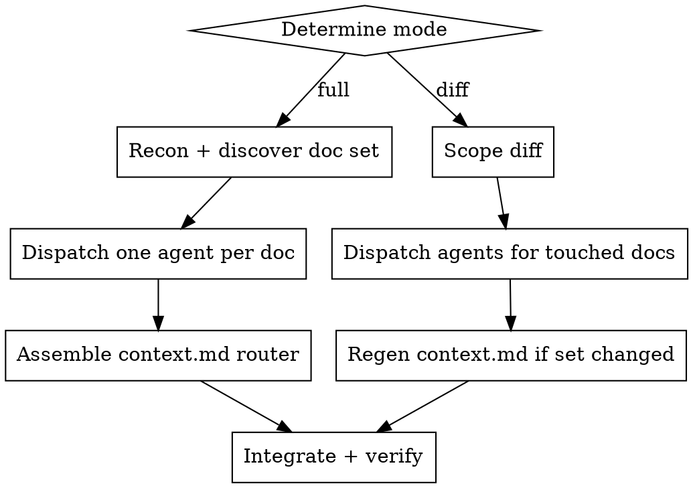

# SDD — Codebase Map (Phase 0)

## Overview

Produce a navigable reference map of a codebase under **`docs/codebase/`**, derived from real code — never from assumptions. The map lets future engineers and AI agents understand the project by opening *one targeted file*, not by re-reading the tree.

This is the **brownfield-analysis phase of the SDD workflow**: `sdd:spec` and `sdd:plan` read this map (especially `context.md`) to ground new features in the project's real patterns and to refuse changes that would break them. The map's job is therefore not just to *describe* the code, but to surface **what is enforced** — so a later phase can mechanically check a plan against it.

The output is not a flat pile of documents. It is a **canonical tree with one agent-facing router at its root**: `context.md` routes by intent and carries the enforced invariants; `overview.md` gives the end-to-end narrative; and six concept directories each hold one focused document per real architectural element, layer, pattern, integration, convention, or risk area found in the repo.

**Core principle:** Evidence over assumption. Every claim cites a real file path. Empty findings are omitted, not invented. A rule with no enforcement mechanism is an aspiration, not an invariant — say so and downgrade it.

**This skill is repository-agnostic in *shape*, repository-specific in *content*.** The structure (tree + router + the six directories + each document's shape) is fixed. *What* goes inside is discovered from the target repo — its real layers, its real patterns, its real integrations. A Django repo and a NestJS repo get the same tree shape filled with completely different documents.

## The output tree

Everything lives under `docs/codebase/` — **this path is fixed.** Do not write to `.specs/`, `vault/`, or any project-specific location even if one exists. If the project already maps itself elsewhere, this skill still produces `docs/codebase/`; mention the other map in your summary, do not redirect output to it.

```
docs/codebase/
├── context.md           # router único otimizado p/ agente: invariantes enforced + stack + navegação + carregamento-por-tarefa + catálogo
├── overview.md          # narrativa de onboarding: fluxo ponta a ponta + princípios (leitura, não roteamento)
├── architecture/        # macroarquitetura — um doc por decisão/estilo arquitetural
├── layers/              # regras por camada — um doc por camada real do projeto
├── patterns/            # padrões táticos e cross-cutting — um doc por padrão real
├── integrations/        # libs/serviços externos plugados no runtime — um doc por integração
├── conventions/         # convenções e enforcement — um doc por família de convenção
└── concerns/            # tech debt, riscos, áreas frágeis — um doc por área de risco
```

`context.md` and `overview.md` are **always** generated. The six directories hold a *discovered* number of files — a small repo might have three patterns and two integrations; a large one, twenty patterns. **You do not invent directories or documents to fill the tree.** If a repo has no external integrations, `integrations/` gets one short note, not fabricated entries.

**`context.md` replaces the old `docs/codebase/README.md` router** — it does the same routing job but is shaped for an agent (it also carries the enforced invariants and per-task loading pointers; see "context.md" below). There is no `docs/codebase/README.md`.

**Never touch the repository's root `README.md`.** That file is operational (setup, scripts, run, troubleshooting) and is owned by humans. `context.md` may *summarize* the stack and *link* to the root README, but this skill only ever writes under `docs/codebase/` — **with one narrow, deliberate exception: the root `CLAUDE.md` and `AGENTS.md` routers**, which this skill keeps in sync with the map (see "CLAUDE.md / AGENTS.md — the root routers must point here"). Those two are routing files, part of the same system as `context.md`; the operational `README.md` is not, and stays untouched.

### context.md — the agent-facing router (the most important output)

This is the file `sdd:spec`/`sdd:plan` load on every run, and the one an implementer subagent's "task briefing" is distilled from. It must stay small — **target a core under ~500 tokens** so loading it is cheap — and it must be honest about what is *enforced* vs merely conventional. Sections, in order:

1. **Invariantes enforced** — the project's non-negotiable rules, **each paired with the mechanism that imposes it** (the lint rule, the hook, the type, the interceptor — with its real path). Example: `domain não importa framework → eslint-plugin-boundaries (eslint.config.mjs)`; `cobertura ≥ 80% → lefthook pre-push`. These are **generated by reading the real enforcers**, not authored by hand. A rule with no enforcer is an aspiration — list it under a separate "convenções (sem enforcement)" note or drop it. This section is what lets a later phase mechanically answer "does this plan violate a project invariant?".
2. **Stack resumida** — concern → tech → canonical doc link (one line each).
3. **Navegação por intenção** — "se você precisa de X → comece por `dir/`" (serves human and agent).
4. **Carregamento por tarefa** — explicit pointers: "task tipo X → carregue estes docs". This is the bridge that makes selective loading work without the consumer guessing. E.g. `feature HTTP nova → layers/presentation-layer.md + patterns/mapper-pattern.md + conventions/testing.md`.
5. **Catálogo** — one bullet per real doc in the six dirs (relative link + one-line hook). The former README's job.

`context.md` does **not** hold the end-to-end trace — that is narrative reading and lives in `overview.md` (which is marked "onboarding, não carregar em tarefa rotineira").

`concerns/` is the one **evaluative** directory — it documents what is *wrong or fragile*, not how the code works. It is governed by a stricter evidence bar (every concern needs a `caminho:linha` anchor, a confirmed `TODO`/`FIXME`, a proven test gap…) and its docs do **not** open with `Regra-de-ouro`. An honestly short `concerns/` beats an inflated one — when in doubt, omit. See `templates/docs/concern.template.md`.

### CLAUDE.md / AGENTS.md — the root routers must point here

`docs/codebase/context.md` is only useful if the agents that start at the repo root are *sent* to it. The repo's root `CLAUDE.md` (Claude Code) and `AGENTS.md` (other agents) are those entry points — thin reading routers that say "for architecture/conventions, go to `docs/codebase/`, open the one doc you need, don't read the tree." If they drift (point at a doc that no longer exists, miss the token-frugal loading rule, or fail to mention `sdd:codebase` as the way to keep the map current), the whole map gets bypassed. So this skill **owns keeping them in sync** with the map it produces.

**This is a deliberate, narrow exception to "write only under `docs/codebase/`."** CLAUDE.md and AGENTS.md are *part of the same routing system* as `context.md` — not the operational root `README.md`, which stays human-owned and untouched. The exception covers exactly these two router files, nothing else at the root.

What "in sync" means — verify and **auto-fix** each:
1. **Points at `docs/codebase/context.md`**, not the abolished `docs/codebase/README.md`. This skill replaced that README with `context.md`; any router still naming `README.md` is stale by definition — rewrite the link.
2. **Carries the token-frugal loading rule**: "open the *one* doc your task needs; do not read the whole `docs/codebase/` tree by default." This is the same selective-loading discipline `context.md`'s "Carregamento por tarefa" encodes — the routers must echo it or agents over-read.
3. **Names `sdd:codebase` (full + diff) as the way the map is kept current**, with diff mode as the after-a-change default.
4. **Carries a one-line testing pointer** when the repo has a test suite: a short line (not the full rule — that lives in `testing.md`) reminding the agent that every dto/mapper/controller (or the repo's equivalent artifacts) has a co-located spec, tests live in `tests/` inside the file's own sub-layer, and the repo is test-first if it declares so — linking to `docs/codebase/conventions/testing.md`. This is the rule humans most often forget; a router that omits it lets agents skip tests, which is exactly what this skill exists to prevent. Derive the line from what `testing.md` actually states — do not invent a granularity the repo doesn't use.
5. **CLAUDE.md and AGENTS.md mirror each other.** AGENTS.md is the non-Claude twin; they carry the same routing table. When you fix one, fix the other — and AGENTS.md states it mirrors CLAUDE.md.

**Full mode guarantees both exist.** If a router is missing, create it as a minimal map-pointing router (the routing table + the three rules above). If both are missing, create both. Never fabricate architecture prose in them — they *route* to `docs/codebase/`, they don't duplicate it. Keep them lean; the canonical content lives in the map.

**Diff mode** re-checks the routers only when the doc set changed (a routing-table entry may be stale) or when `context.md` itself was regenerated — then reconcile and report. Otherwise leave them byte-identical.

Always **report the router edits** in the final summary (what drifted, what you fixed), the same as any other written file.

## Document language and shape

All generated content is **Portuguese (PT-BR)** — this matches the canonical style. Headers, prose, and explanations in PT-BR; code identifiers, file paths, and library names stay verbatim.

**Every doc opens with YAML frontmatter** — it is cheap, structured, and lets the diff mode and the consuming phases reason about staleness per-doc:

```yaml
---
title: Domain Layer
area: layers            # context.md | overview | architecture | layers | patterns | integrations | conventions | concerns
generated: 2026-06-22   # data desta geração (passada por você ao agente — não calcule no agente)
sources:                # os globs/paths que ESTE doc descreve — a base honesta de staleness
  - src/modules/**/domain/
  - src/shared/domain/
---
```

Why `sources` and not a commit SHA: a global `mapped_at: <sha>` *lies* — it can't tell which commits actually touched what this doc describes. With `sources`, staleness is computable and per-doc: "any commit after `generated` touched a path in `sources`?" → only that doc is stale. This is exactly what the diff mode and the `sdd:spec`/`sdd:plan` staleness gate consume. The `## Changelog` line (added in diff mode) stays as the human-readable complement.

This frontmatter is required on **every** generated doc — the six descriptive dirs, `concerns/`, `overview.md`, and `context.md` alike. The per-agent dispatch contract makes each agent emit it as step 0; you only author it directly for the files you assemble yourself (`context.md`).

Every document under the five **descriptive** directories (`architecture/`, `layers/`, `patterns/`, `integrations/`, `conventions/`) follows the same archetype below. `concerns/` is **evaluative** and follows a different shape — findings anchored to real paths, no `Regra-de-ouro` — detailed in its own archetype. This consistency is what makes the map navigable: a reader who has seen one pattern doc knows exactly where to look in any other.

```markdown
# <Nome do conceito>

## Regra-de-ouro            # a invariante central, em 1–3 frases. O leitor que só lê isto já acerta 80%.

## <onde está / como funciona>   # código REAL do repo, com `// caminho/do/arquivo` como comentário
                                 # mostra a coisa, não a descreve

## <enforcement / regra mecânica>  # se há lint/CI/types que IMPÕE a regra, cite o trecho real
                                   # (omita se o repo não impõe nada)

## Anti-padrões             # lista com ❌ — o que parece certo mas viola a regra
```

Reference archetypes live in `templates/docs/`. Each agent reads the archetype matching its directory:

| Directory | Archetype | Alvo de tamanho | Captures |
|---|---|---|---|
| `architecture/` | `templates/docs/architecture.template.md` | ~150–350 linhas | Estilos/decisões macro: regra de dependência, ports & adapters, CQRS, bounded contexts, monorepo layout |
| `layers/` | `templates/docs/layer.template.md` | ~120–250 linhas | Uma camada real do projeto (domain, application, infra, presentation — ou o que o repo usar) |
| `patterns/` | `templates/docs/pattern.template.md` | ~80–200 linhas | Um padrão tático concreto (entity, value-object, mapper, facade, DI, error-handling…) |
| `integrations/` | `templates/docs/integration.template.md` | ~15–60 linhas | Uma lib/serviço externo: o que é, onde está plugado, regras |
| `conventions/` | `templates/docs/convention.template.md` | ~80–200 linhas | Naming, testing, quality gates, lint boundaries |
| `concerns/` | `templates/docs/concern.template.md` | ~20–120 linhas | Tech debt, riscos, áreas frágeis — **evaluative**, sem `Regra-de-ouro`, achados ancorados em `caminho:linha` com severidade |

`overview.md` follows `templates/overview.template.md` (~120–250 linhas). `context.md` follows `templates/context.template.md` — it is assembled **last**, from the final list of files that actually exist (you need the real doc set to write the catálogo and the per-task loading pointers).

These sizes are **targets, not hard caps** — calibrated to the canonical style, where docs are lean (an integration doc can be ~18 lines; a pattern doc rarely needs 200). They exist to fight bloat: a doc that blows well past its target is usually padding prose where one real code excerpt would do. If a doc genuinely needs more, prefer pushing detail down to a sibling doc and cross-linking over one giant file.

## Two modes

| Mode | Trigger | Scope | Behavior |
|---|---|---|---|
| **Full** (default) | "map the codebase", "/sdd:codebase", onboarding a repo | Entire repository | Discovers the document set, generates the whole tree, then assembles `context.md` |
| **Diff** | "map the diff", "/sdd:codebase diff", "update the map" | Changed files only (branch vs base) | Updates only the documents the change touches; regenerates `context.md` only if the file set changed; appends a dated changelog line to each touched doc |

If the mode is ambiguous and a `docs/codebase/` map already exists, default to **Diff**. Otherwise **Full**. Both modes are inherited intact from the proven mapper — diff mode (merge-base scoping, orphan pruning, per-doc changelog) is the engine that keeps the map current and is **not** optional in this skill.

**Full mode is idempotent and authoritative.** Running it on a repo that already has a `docs/codebase/` re-derives the whole tree from current code and makes the directory match the new doc plan exactly — including **deleting** docs whose subject no longer exists (a removed pattern, a dropped integration). Read an existing map at most once for orientation, but trust the code, not the old map: stale maps are a top source of wrong facts. The end state is "the map a fresh run would produce", not "old map plus edits".

## Workflow



### Step 1 — Recon and discover the document set (full mode; you do this)

The hardest and most important step. The skill's value is that the *document set fits the actual repo*, so spend real effort here before dispatching anything.

First gather shared facts cheaply (don't burn context on file bodies):
- Dependency manifests (`package.json`, `pyproject.toml`, `go.mod`, `Cargo.toml`, `Gemfile`, `pom.xml`, `composer.json`…) → stack + integration signal. The manifest is language-agnostic intent; the import graph is truth.
- Directory tree to depth 3, excluding `node_modules`, `dist`, `build`, `.git`, `vendor`, `target`, `__pycache__`.
- Build/CI/lint config presence (`turbo.json`, `Makefile`, `.github/workflows/`, `eslint.config.*`, `biome.json`, `ruff.toml`, `.golangci.yml`…) → enforcement signal.
- **Runtime-lib inventory (drives `integrations/`):** from the manifest dependencies, pull the libs that are actually imported in app code, and bucket them by concern — data/query, validation/schema, charting/viz, date/time, drag-and-drop, date/calendar pickers, forms, auth/crypto, http client, logger, ORM/db client, ui-primitive system. Each non-trivial bucket that shows up in real imports earns its own integration doc (one lib = one doc; see the `integrations/` rule). This inventory is the input to the coverage gate in Step 5 — capture it now.
- **Test-suite signal (drives `conventions/testing.md`):** detect the test runner (manifest dep / `test`/`spec` script) and the test-file convention actually used (`*.test.*`, `*.spec.*`, `*_test.*`, `test_*.*`, a `tests/`/`__tests__/`/`spec/` dir). If any exists, `conventions/testing.md` is in the plan — not optional. Beyond *that* a suite exists, capture **how it is organized**, because this is the rule humans forget and the map exists to make binding:
  - **Spec co-location granularity** — find where a spec lives *relative to the file it tests*. Open 5–10 real spec/source pairs across different sub-layers (a dto, a mapper, a controller, a handler). Record the exact mirror rule the repo follows: e.g. "spec lives in a `tests/` folder inside the file's **own** sub-layer (`dtos/tests/`, `mappers/tests/`, `http/tests/`), not in a generic `tests/` of the layer above". The granularity (per-sub-layer vs per-layer vs sibling `.spec` file) is repo-specific — read it, don't assume.
  - **Per-artifact coverage rule** — check whether the repo expects *every* artifact of a kind to have a spec (every dto/mapper/controller/handler/use-case has a co-located spec). Look for artifacts that have one and infer the rule from the convention, plus any doc/CLAUDE.md/AGENTS.md line stating it. If the repo states "every X has a spec", that is a convention to record verbatim — and if a real artifact is missing its spec, that is a `concerns/` finding.
  - **TDD stance** — if the repo states a test-first/TDD policy anywhere (`testing.md`, `CLAUDE.md`, `AGENTS.md`, contributing docs, a plan), record it as the policy, not as a suggestion. Test-first is the default stance to surface when stated.
- **Enforcer inventory (drives `context.md` › Invariantes enforced):** find the *mechanisms* that make rules binding, not the rules in prose. Read the lint boundary config (`eslint-plugin-boundaries` rules, import rules), coverage thresholds and git hooks (`lefthook.yml`, `husky`, `.git/hooks`), global interceptors/guards/pipes that shape every response, and type-level contracts that pin invariants. Each becomes one "rule → mechanism (path)" line. A rule you can't tie to a mechanism is an aspiration — keep it out of "enforced".

Confirm a repo with `git rev-parse --is-inside-work-tree`. Prefer ripgrep/ast-grep over grep.

Then **derive the document list per directory** from what you found — this is discovery, not a fixed checklist:

- **`architecture/`** — one doc per macro decision the code actually commits to. Signals: a layered folder convention repeated across modules → a dependency-rule doc; abstract ports + concrete adapters → a ports-&-adapters doc; command/query/handler split → a CQRS doc; multiple self-contained modules → a bounded-contexts doc.
- **`layers/`** — one doc per layer the repo really has. Read the folder convention inside a representative module (`domain/`, `application/`, `infrastructure/`, `presentation/` — or `models/`/`services/`/`views/`, or whatever this stack uses). One doc per layer that exists. Don't impose a four-layer model on a repo that has two.
- **`patterns/`** — one doc per *recurring* tactical pattern, evidenced by ≥2 occurrences. Mappers, entities, value objects, facades, DI wiring, error handling, env validation, helper conventions. A one-off is not a pattern — don't document it.
- **`integrations/`** — one doc per external lib/service that the runtime actually wires in (not every transitive dependency). Database client, logger, tracer, auth/crypto libs, HTTP doc generators, health probes, charting, date/time, schema-validation, drag-and-drop, date-pickers, form libraries, state/query libs. Cross-check the manifest against real `import`/adapter code. **One distinct runtime lib = one doc — never fold several unrelated libraries into a shared "ui-libs"/"misc" doc.** Two libs share a doc only when one is a thin plugin/adapter of the other (e.g. a Radix primitive + its shadcn wrapper, a query lib + its devtools). A charting lib, a date lib, a validation lib, and a drag-and-drop lib are four separate concerns → four docs. The bar for inclusion: it appears in real `import` statements in app code (not just the manifest) and shapes runtime behavior. Err toward a doc per lib; an integration doc can be ~18 lines, so granularity is cheap.
- **`conventions/`** — naming, testing, quality gates, and any *mechanical* enforcement (lint boundary rules, coverage thresholds, commit hooks). The enforcement docs are the highest-value ones — they turn "we try to" into "the build fails if". **Testing gets its own dedicated `conventions/testing.md` whenever the repo has ANY test suite** (a test runner in the manifest, a `test`/`spec` script, or real `*.test.*`/`*.spec.*`/`*_test.*`/`test_*.*` files). It is not optional and is not allowed to be a thin paragraph folded inside a quality-gates doc — it covers: the test stack (runner, assertion/DOM libs, e2e tool), how tests are organized and named, the commands to run them, coverage config/thresholds if any, and the TDD/policy stance if the repo states one. Keep a separate quality-gates doc for lint/format/typecheck/hooks; testing is its own concern. Only omit `testing.md` if the repo genuinely has zero tests — and then say so in the report.
    **`testing.md` must state these three things explicitly** (they are the rules humans keep forgetting, so the map's whole point is to make them binding):
    1. **Spec co-location** — the exact mirror rule, at the granularity the repo actually uses (e.g. "a spec lives in `tests/` inside the file's **own** sub-layer — `dtos/tests/`, `mappers/tests/`, `http/tests/` — never in a generic `tests/` of the layer above"), with a real source/spec path pair proving it.
    2. **Per-artifact coverage** — which artifacts are required to have a co-located spec (e.g. "every dto, mapper and controller has a spec"), recorded as the repo states it.
    3. **TDD stance** — if the repo declares test-first, state it as policy here, and list it under `context.md` › Invariantes enforced if a hook/CI gate makes it binding (otherwise under "convenções (sem enforcement)").
    The `## Anti-padrões` of `testing.md` names the literal mistakes these rules prevent — `❌ mapper/dto/controller sem spec`, `❌ spec fora do tests/ da própria sub-camada` — so a reader who skims only that section still avoids them.
  - **CI/CD + container build:** quando existirem `Dockerfile`, `bitbucket-pipelines.yml` (ou `.github/workflows/`), `.dockerignore` → planejar `conventions/dockerfile.md` e `conventions/<ci-tool>-pipelines.md` (ex.: `bitbucket-pipelines.md`). O sinal "build/CI/lint config presence … enforcement signal" já existe; estes geram docs **dedicados** de convenção, nunca um dir novo.
- **`concerns/`** — one doc per *risk area* that has **real, anchored** findings. Sweep `TODO`/`FIXME`/`HACK` markers, business-rule files missing co-located tests, **any artifact the testing convention requires a spec for (dto/mapper/controller/handler) that has none — a missing spec is an anchored, real concern, not a nitpick**, `@ts-ignore`/`eslint-disable`/`any` at sensitive points, security smells (hardcoded secret, unvalidated entrypoint input, weak crypto), perf smells (N+1, I/O in loops, unpaginated growth), stale deps. Group findings into files like `security-gaps.md`, `perf-hotspots.md`, `fragile-areas.md`, `tech-debt.md`. **Stricter evidence bar than every other directory** — a concern without a `caminho:linha` anchor, a confirmed marker, or a proven gap is speculation; cut it. If a risk area has no anchored finding, do not create its file. If *nothing* is found anywhere, `concerns/` gets a single `tech-debt.md` noting "nenhum achado relevante" — do not pad it.
  - **Machine-parseable contract (so `sdd:plan` can ingest scoped remediation):** each finding carries a stable `id`, a `severidade` enum, and an anchor **with a line number**. This is non-negotiable for concerns because a later phase filters them by file path. The shape lives in `concern.template.md`:
    ```
    - id: CONCERN-007
      severidade: alta            # enum: alta | média | baixa
      ancora: src/modules/notification/seru-notification.adapter.ts:42
      descricao: timeout do stream upstream não tratado
    ```
    A bare `Âncora:` without `:linha` or a severity written in prose is not parseable — give the line and the enum.

Produce an explicit **doc plan** before dispatching: a flat list of every file you will generate, e.g. `architecture/clean-architecture.md`, `layers/domain-layer.md`, `patterns/mapper-pattern.md`, `integrations/mongoose.md`, `conventions/eslint-boundaries.md`. Keep file names kebab-case and self-describing. This list *is* the dispatch plan and *is* the input to `context.md`.

### Step 2 — Dispatch one agent per document (REQUIRED in full mode)

Each document is an independent problem. **Dispatch every doc in the plan — plus `overview.md` — as parallel agents.** Do not write the tree yourself, sequentially, and do not group the dispatch by directory.

**Batching, when the plan is large.** Parallel-agent dispatch has a concurrency ceiling (~10 simultaneous). So:
- Doc plan ≤ ~10 docs → dispatch **all in a single message.** This is the common case and the ideal.
- Doc plan > ~10 → dispatch in **full batches of ~10 in a single message each**, back to back. Each batch is still a real fan-out; you are working around the ceiling, not serializing by choice. **Never** batch by directory (architecture/ then layers/…) — that produces tiny, lopsided waves and wastes the parallelism. Fill each batch to ~10 regardless of which dir the docs belong to.

The distinction matters: one wave per directory is an *anti-pattern* (lopsided, slow); ~10-doc batches are the *correct* way to respect the ceiling on a big repo.

**REQUIRED BACKGROUND:** Use superpowers:dispatching-parallel-agents for the dispatch pattern.

Each agent receives: the repo root, its ONE target path under `docs/codebase/`, the **archetype template for its directory**, the recon summary, and the full doc plan (so it can cross-link to sibling docs by relative path). The exact per-agent contract is in [templates/agent-dispatch.md](templates/agent-dispatch.md).

Each agent returns finished PT-BR markdown for its one file. **You** write the files after agents return — subagents cannot persist host-filesystem writes.

`overview.md` is one of those agents — its own agent using `templates/overview.template.md`, fired in the same single message as the rest. The only thing **not** dispatched is `context.md` (see Step 3).

### Step 3 — Assemble the context.md router (full mode; you do this, last)

`context.md` is **not** dispatched — it is mechanical assembly over the files that now exist plus the enforcer inventory you gathered in Step 1, so you build it yourself once everything is written. It is the single most consumed output, so keep its core lean (target ~500 tokens). Follow `templates/context.template.md`:

1. **Invariantes enforced** — turn the Step 1 enforcer inventory into "rule → mechanism (path)" lines. Only rules tied to a real mechanism (lint/hook/type/interceptor). Rules without enforcement go in a short "convenções (sem enforcement)" note, not here. This section is the contract `sdd:plan`'s `/analyze` checks a plan against — get the mechanism path right.
2. **Stack resumida** — concern → tech → canonical doc link, one line each.
3. **Navegação por Intenção** — reader intent → entry point (`dir/`).
4. **Carregamento por tarefa** — "task tipo X → carregue estes docs", using the real doc set. This is what lets a consumer load only what a task needs.
5. **Catálogo** — every generated file as a relative link with a one-line hook. Group `patterns/` by sub-theme (Domain / Application / Boundaries / Presentation / Cross-cutting) when there are enough to warrant it; otherwise a flat list.

`context.md` must list **exactly** the files that exist — no dead links, no omissions. Build it from your doc plan after confirming each file was written. Do **not** put the end-to-end trace here (that is `overview.md`).

**Then reconcile the root routers (full mode).** Once `context.md` exists, check `CLAUDE.md` and `AGENTS.md` at the repo root against it (see "CLAUDE.md / AGENTS.md — the root routers must point here"): each must point at `context.md` (never the abolished `docs/codebase/README.md`), carry the token-frugal one-doc loading rule, name `sdd:codebase` (full + diff) for staleness, and mirror each other. Auto-fix any drift; create either router if missing. This is the one place the skill writes outside `docs/codebase/`, and it's intentional — the routers are the map's front door.

### Step 4 — Diff mode (replaces Steps 1–3 in diff mode)

1. Detect the base branch: try `git symbolic-ref refs/remotes/origin/HEAD` (the remote's default), else `git remote show origin`, else the first that exists among `main`/`master`/`develop`/`prod`. Then `BASE=$(git merge-base <base-branch> HEAD)`. If `merge-base` fails (shallow clone — common in CI), run `git fetch --unshallow` (or `--deepen=100`) first, or fall back to diffing against the base branch tip directly. If you truly cannot establish a base, **say so and switch to full mode** rather than guessing a diff.
2. `git diff --name-only "$BASE"...HEAD` → changed paths.
3. Route each changed path to affected docs (table below). A changed file may map to an existing doc *or* reveal a brand-new concept needing a new doc.
4. Dispatch agents only for affected docs. Each diff-agent reads the existing doc + the changed files and returns it with a `## Changelog` line appended (`- YYYY-MM-DD: <o que mudou>`) and its `generated:` frontmatter date refreshed. Pass the date in — do not let the agent compute it.
5. If the set of files changed (a doc added or removed), **regenerate `context.md`** (Step 3). Even if the file set is unchanged, refresh `context.md`'s "Invariantes enforced" if an enforcer config (lint boundaries, hooks, coverage threshold, a global interceptor) was among the changed paths — a changed enforcer means the contract `sdd:plan` checks against changed. Otherwise leave `context.md` byte-identical.
6. **Reconcile the root routers when relevant.** If the doc set changed (a routing-table entry may now be stale) or `context.md` was regenerated, re-check `CLAUDE.md`/`AGENTS.md` against `context.md` and auto-fix any drift (link target, the one-doc loading rule, the `sdd:codebase` mention, mirror parity). If neither changed, leave the routers byte-identical. Report any router edit.
7. Leave every unaffected doc byte-identical.

**Path → doc routing:**

| Changed path signal | Affected docs |
|---|---|
| dependency manifest, lockfile, build config | `overview.md`, relevant `integrations/*`, maybe `conventions/quality-gates` |
| new module / new layer folder | `overview.md`, `architecture/*`, the relevant `layers/*` |
| new adapter / service client / external lib wired in | new or existing `integrations/*`, `architecture/*` |
| recurring new tactical pattern across files | new or existing `patterns/*` |
| lint/boundary/test config, coverage threshold, hooks | `conventions/*` **and** `context.md` › Invariantes enforced (the mechanism changed) |
| naming/structure shift across several files | `conventions/naming-conventions`, affected `layers/*` |
| `Dockerfile`, `bitbucket-pipelines.yml`, `.dockerignore`, `.github/workflows/` | `conventions/dockerfile.md`, `conventions/<ci>-pipelines.md`, maybe `overview.md` |
| new/removed `TODO`/`FIXME`/`HACK`, removed tests, risky change, fix that resolves a known issue | `concerns/*` — **add new findings AND remove the ones the diff resolved.** Don't leave dead concerns. When a `sdd:plan` remediation task resolved a `CONCERN-NNN`, remove it and note it in the changelog. |

### Step 5 — Integrate and verify

- **Handle agent failures first.** Some agents may fail, time out, or return junk (empty, wrong language, no real paths). For each, **re-dispatch that one doc once.** If it fails again, drop it from the doc plan and note it in the report — do **not** leave a half-written file and do **not** let `context.md` link to a doc that was not produced.
- Write all (surviving) files to their paths under `docs/codebase/`. **Never write outside `docs/codebase/` — in particular, never touch the repo's root `README.md`.**
- **Prune orphans (full mode).** List what already exists under `docs/codebase/` and delete any `*.md` not in the final doc plan — a previous run may have produced docs for patterns/integrations that no longer exist. A stale doc that `context.md` does not link is exactly the orphan this skill forbids; the skill must not create it. If an old `docs/codebase/README.md` exists from a prior mapper run, delete it — `context.md` replaces it.
- Confirm every file in the final doc plan exists (`test -e`).
- Spot-check 2–3 cited file paths per doc actually exist — agents hallucinate paths.
- **Verify `context.md`:** every line under "Invariantes enforced" names a real mechanism at a real path (the rule is *enforced*, not just claimed); the "Carregamento por tarefa" pointers reference docs that exist; the core stays lean (~500 tokens). A vague invariant with no mechanism is the failure mode this section exists to prevent — fix or downgrade it.
- Spot-check that each `concerns/` finding carries a real `ancora: caminho:linha`, a `severidade` enum, and a stable `id`. A concern that isn't machine-parseable defeats the `sdd:plan` ingestion — cut it or fix it.
- Confirm every `context.md` link resolves to a real file and every real file is linked (no orphans, no dead links).
- **Verify the root routers.** `CLAUDE.md` and `AGENTS.md` both exist (full mode), point at `docs/codebase/context.md` (not `README.md`), carry the one-doc token-frugal loading rule, name `sdd:codebase`, carry the one-line testing pointer (co-located spec per sub-layer + every dto/mapper/controller has a spec + test-first, linking `testing.md`) when the repo has tests, and mirror each other. Any router link must resolve to a real file. A router still pointing at the abolished `docs/codebase/README.md` is the canonical drift this check exists to catch.
- **Coverage gate (full mode).** Before declaring done, cross-check the doc plan against the recon facts so nothing real went unmapped:
  - **Integrations:** list the runtime libs found in real `import`/`require`/`use`/`include` statements in app code. Every one that shapes runtime behavior must have its own `integrations/*.md` (per the one-lib-one-doc rule). If a lib appears in app imports but has no doc — and is not a thin plugin of a documented lib — that is a gap: add the doc and re-verify. Name the check in the report ("N runtime libs imported, N integration docs").
  - **Testing:** if any test runner / test script / test file exists, `conventions/testing.md` must exist. If it doesn't, that is a gap, not a choice. And it is not enough that the file *exists* — verify it states the three required rules: spec co-location granularity (with a real source/spec path pair), the per-artifact coverage rule, and the TDD stance if the repo declares one. A `testing.md` that lists the runner but omits where specs live and which artifacts need one has the same gap the user keeps hitting — fix it before declaring done.
  - **CI/CD & container:** se há `Dockerfile` ou um arquivo de pipeline (`bitbucket-pipelines.yml`, `.github/workflows/`), os docs de convenção correspondentes (`conventions/dockerfile.md`, `conventions/<ci>-pipelines.md`) devem existir — paridade com a regra de testing.
  - **Layers & patterns:** every layer folder a representative module actually has → a `layers/*` doc; every tactical pattern with ≥2 occurrences → a `patterns/*` doc. A real layer/pattern with no doc is a gap.
  - **Invariantes enforced parity:** every enforcer found in Step 1 (lint boundary rule, coverage threshold, hook, global interceptor) appears as a line in `context.md`. A real enforcer with no line is a gap — the consuming phase would miss a project rule.
  - This gate is what makes the map "100% mapped" — a fresh full run must leave no real integration, layer, recurring pattern, test suite, or enforced invariant undocumented. Run it before writing the report; close any gap found, don't just note it.
- Report: mode, files written/updated/pruned, any agent that failed twice, the final doc plan, the coverage-gate result (libs imported vs docs, testing doc present, enforcers vs invariant lines), **the router reconciliation (CLAUDE.md/AGENTS.md: in-sync / fixed-what / created)**, any unverifiable claim.

## Quality rules

- **Toda afirmação cita um caminho real.** Sem caminho = não acionável = corta.
- **Regra-de-ouro primeiro** (nos cinco dirs descritivos). Cada doc de `architecture/`, `layers/`, `patterns/`, `integrations/`, `conventions/` abre com a invariante. Se você não consegue escrevê-la em três frases, ainda não entendeu o conceito — leia mais código. `concerns/` é a exceção: é avaliativo, abre nos achados, sem regra-de-ouro.
- **Mostre código real, não pseudocódigo.** Trechos vêm do repo, com o caminho no comentário. O exemplo prova a regra.
- **Cite o enforcement quando existir.** "Imposto por X" vale dez vezes mais que "convencionou-se que". Procure lint rules, type checks, CI gates, hooks.
- **Observado, não ideal.** Documente o que o código faz, inclusive inconsistências. Não prescreva o que *deveria* ser.
- **Omita o vazio.** Sem integrações externas → uma nota curta, não entradas inventadas. Sem anti-padrões reais → corte a seção.
- **Amostre, não exaustione.** 5–10 arquivos representativos por área batem ler tudo.
- **Cross-link denso.** Cada doc aponta para os irmãos relevantes por caminho relativo (`[mapper-pattern.md](../patterns/mapper-pattern.md)`). É isso que transforma arquivos soltos numa árvore navegável.

## Common mistakes

| Mistake | Fix |
|---|---|
| Generating a flat list of docs with no `context.md` router | `context.md` *is* the map's entry point. Assemble it last, over the real file set. |
| Touching the repo's root `README.md` | That file is operational and human-owned. This skill writes only under `docs/codebase/` (plus the CLAUDE.md/AGENTS.md routers). `context.md` may link to the root README, never edit it. |
| Leaving CLAUDE.md/AGENTS.md pointing at `docs/codebase/README.md` | That router was abolished for `context.md`. Auto-fix both root routers to point at `context.md`, keep them mirrored, and carry the one-doc loading rule + the `sdd:codebase` mention. |
| Editing root files other than the two routers | The exception is exactly CLAUDE.md + AGENTS.md. Nothing else at the root — not `README.md`, not `package.json`. |
| Putting an invariant in `context.md` with no enforcing mechanism | "Invariantes enforced" means enforced. Each line names the lint rule / hook / type / interceptor at its real path. A rule with no mechanism is an aspiration — move it to a "sem enforcement" note or drop it. |
| Keeping a global `mapped_at: <sha>` to track staleness | A global SHA lies about per-doc staleness. Use `generated:` + `sources:` in frontmatter — staleness is then "any commit after `generated` touched a `sources` path?", per-doc. |
| Forcing the seru repo's exact doc list onto a different stack | Discover the doc set from the *target* repo. The tree shape is fixed; the contents are not. Use that repo's own manifest/import graph — `package.json` for JS, `pyproject.toml`/imports for Python, `go.mod` for Go, etc. The six dirs and the doc archetype stay identical across languages; only the discovered content changes. |
| Folding several runtime libs into one "ui-libs"/"misc"/"shared" integration doc | One distinct runtime lib = one doc. A charting lib, a date lib, a validation lib, a drag-and-drop lib, a date-picker are separate concerns → separate docs. Group only a thin plugin with its host (Radix primitive + shadcn wrapper). Run the Step 5 coverage gate: imported libs vs integration docs. |
| Treating testing as a stray paragraph inside a quality-gates doc, or skipping it | If the repo has any test suite, `conventions/testing.md` is mandatory and dedicated (stack, organization, commands, coverage, policy). Quality-gates covers lint/format/typecheck/hooks; testing is its own doc. |
| `testing.md` that lists the runner but not where specs live or which artifacts need one | The three rules are mandatory: spec co-location at the repo's real granularity (with a proven source→spec path pair), per-artifact coverage (every dto/mapper/controller has a spec), and TDD stance. These are the rules humans forget — omitting them defeats the doc's purpose. Step 5 checks for them. |
| Routers (CLAUDE.md/AGENTS.md) silent on testing | When the repo has tests, both routers carry a one-line testing pointer (co-located spec per sub-layer + every dto/mapper/controller has a spec + test-first) linking `testing.md`. A router that omits it lets agents skip tests. |
| Writing the tree yourself, sequentially | Dispatch one parallel agent per doc. That is the engine of this skill. |
| English output | Content is PT-BR. Only identifiers/paths/lib names stay verbatim. |
| A doc that describes a pattern in prose with no real code | Every doc shows a real excerpt with its path. The code *is* the documentation. |
| Inventing integrations/patterns/concerns to fill a directory | Evidence ≥2 occurrences for a pattern; real wiring for an integration; a `caminho:linha` anchor for a concern. Omit otherwise. |
| Giving `concerns/` docs a `Regra-de-ouro`, or padding them with speculative risk | Concerns are evaluative: open at findings, every one anchored + severity-tagged. An honestly short `concerns/` beats an inflated one. |
| A concern written in prose (`Âncora:` without a line, severity as a sentence) | The concern contract is machine-parseable: `id`, `severidade` enum, `ancora: caminho:linha`. `sdd:plan` filters by path — prose can't be filtered. |
| Diff mode leaving a resolved concern in place | When a diff fixes an issue, remove that concern and note the removal in its changelog. |
| `context.md` with dead links or orphan files | Build `context.md` from the verified file list; check both directions. |
| Diff mode rewriting whole docs or skipping `context.md` regen | Append a dated changelog; regenerate `context.md` only when the file set changed (or an enforcer config changed). |
| Writing to `.specs/`, `vault/`, or the repo's own map dir | Output is always `docs/codebase/`. Mention other maps, don't redirect. |
| Criando um dir top-level `cicd/`, `ci/` ou `deploy/` para Docker/pipeline | CI/CD e container build vivem em `conventions/` (`dockerfile.md`, `<ci>-pipelines.md`). A árvore é fixa em 6 dirs — nunca crie um sétimo. |
